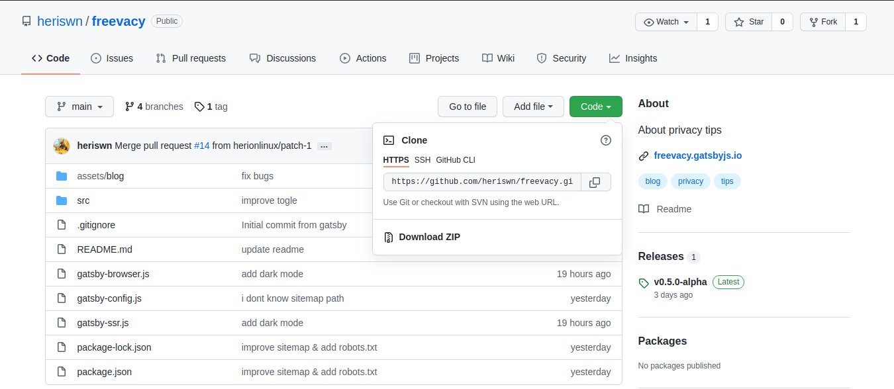

## Keyword penting yang harus diketahui ketika kita bekerja dengan git dan github:

Sebelumnya pastikan configurasi atau identitas git nya dengan perintah berikut

`git config --global user.email "emai mu"`

`git config --global user.name "user name mu"`

Setelah set diatas, baru lanjut bekerja dengan git dan github.
Berikut perintah-perintah penting yang mesti kamu ketahui:

- Clone Repository

    `git clone url-git`

    contoh ambil url-git nya dari sini ya.
    

    `git clone https://github.com/heriswn/freevacy.git`

- Membuat branch atau percabangan baru

    `git checkout -b nama-branch`

    ganti nama-branch dengan nama yang kita inginkan.

- Update branch ke main/master

    `git push origin nama-branch`

- Kembali ke branch main/master

    `git checkout main`

    Kalau kasusnya dari branch langusng di update ke github, nanti ketika kembali ke branch main/master nya kan belum update, cara update main/master gunakan perintah

    `git pull`

- Delete branch

    `git branch -d nama-branch`

- Cek status di repositroy

    `git status`

    dengan perintah diatas, kita jadi tau apa yang kita butuhkan, misal: repository local dengan github up to date dan lain-lain.

- Update ke local repository

    `git add .`

    perintah . (titik) disini artinya update semua file yang berubah. Kalau mau tiap file nya bisa dengan perintah

    `git add nama-file`

- Kasih pesan perubahan (commit)

    `git commit -m "pesannya"`

    nanti ganti pesannya apa, perubahan apa yang terjadi pada code-nya.

- Update ke github

    `git push`

    perintah ini untuk mengupdate repository di local ke github.

- Cara kembali ke commit sebelumnya

    `git reset --hard commit-code`

    `git push --force`

